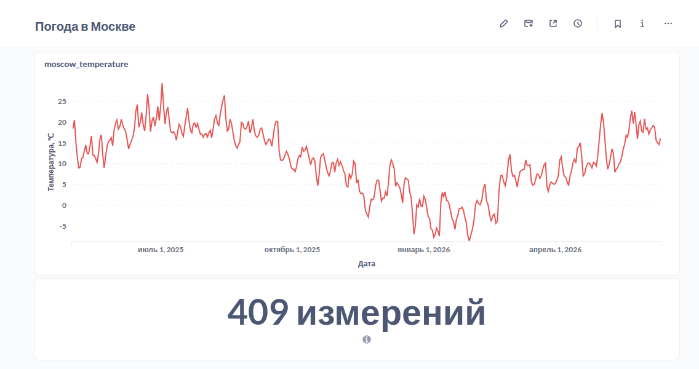

# Weather Data Pipeline

## Описание проекта

Учебный Data Engineering проект, демонстрирующий построение полного ELT-конвейера для сбора, хранения, обработки и визуализации данных о погоде.

Проект реализует современный подход к работе с данными с использованием Apache Airflow, объектного хранилища S3 (MinIO), PostgreSQL, DuckDB и Metabase.

Конвейер автоматически:

* получает данные о погоде из внешнего API;
* сохраняет сырые данные в Data Lake;
* загружает данные в PostgreSQL;
* формирует аналитические витрины;
* визуализирует результаты в Metabase.

---

## История проекта

Первоначально проект разрабатывался как система мониторинга землетрясений.

Планировалось получать данные о сейсмической активности через открытое API, сохранять их в Data Lake и строить аналитические отчёты.

Однако в процессе разработки возникли проблемы с доступом к используемому API из-за геополитических ограничений. Чтобы сохранить архитектуру проекта и сосредоточиться на инженерной части, источник данных был заменён на API погоды Open-Meteo.

Поэтому в истории коммитов и некоторых ранних артефактах проекта могут встречаться упоминания землетрясений (earthquakes).

---

## Архитектура

```text
                   Open-Meteo API
                           │
                           ▼
                Airflow DAG №1
              raw_from_api_to_s3
                           │
                           ▼
                 MinIO (Data Lake)
                           │
                           ▼
                Airflow DAG №2
               raw_from_s3_to_pg
                           │
                           ▼
                     PostgreSQL
                       ODS слой
                           │
         ┌─────────────────┴─────────────────┐
         ▼                                   ▼
 Airflow DAG №3                     Airflow DAG №4
 Средняя температура            Количество записей
         │                                   │
         └─────────────────┬─────────────────┘
                           ▼
                    DM-витрины
                           │
                           ▼
                       Metabase
```

---

## Используемый стек

### Хранение данных

* PostgreSQL
* MinIO (S3-compatible Storage)

### Оркестрация

* Apache Airflow

### Обработка данных

* Python
* SQL
* DuckDB

### Визуализация

* Metabase

### Инфраструктура

* Docker Compose

---

## Этапы конвейера

### 1. Загрузка данных из API

DAG:

```text
raw_from_api_to_s3
```

Функции:

* получение погодных данных через Open-Meteo API;
* преобразование данных в формат Parquet;
* сохранение файлов в MinIO.

---

### 2. Загрузка данных в PostgreSQL

DAG:

```text
raw_from_s3_to_pg
```

Функции:

* чтение данных из MinIO;
* обработка через DuckDB;
* загрузка в PostgreSQL.

Целевая таблица:

```sql
ods.fct_weather
```

---

### 3. Построение аналитических витрин

#### Средняя температура по дням

DAG:

```text
fct_avg_temp_weather
```

Витрина:

```sql
dm.fct_avg_day_weather
```

Содержит:

* дату;
* среднюю температуру за день.

---

#### Количество наблюдений по дням

DAG:

```text
fct_count_records_day_weather
```

Витрина:

```sql
dm.fct_count_day_weather
```

Содержит:

* дату;
* количество полученных записей.

---

## Модель данных

### ODS слой

#### ods.fct_weather

| Поле                 | Описание                |
| -------------------- | ----------------------- |
| time                 | Время наблюдения        |
| temperature_2m_c     | Температура             |
| relative_humidity_2m | Относительная влажность |
| dew_point_2m_c       | Точка росы              |
| latitude             | Широта                  |
| longitude            | Долгота                 |
| elevation            | Высота над уровнем моря |
| timezone             | Часовой пояс            |

---

### DM слой

#### dm.fct_avg_day_weather

Витрина средней температуры по дням.

#### dm.fct_count_day_weather

Витрина количества погодных наблюдений по дням.

---

## Airflow DAGs

| DAG                           | Назначение                                |
| ----------------------------- | ----------------------------------------- |
| raw_from_api_to_s3            | Получение данных из API и сохранение в S3 |
| raw_from_s3_to_pg             | Загрузка данных в PostgreSQL              |
| fct_avg_temp_weather          | Расчёт средней температуры                |
| fct_count_records_day_weather | Расчёт количества записей                 |

Для соблюдения порядка выполнения используются `ExternalTaskSensor`.

---

## Дашборд

### Metabase



Дашборд содержит:

* динамику средней температуры;
* количество полученных наблюдений.

---

## Запуск проекта

### Запуск инфраструктуры

```bash
docker compose up -d
```

---

### Настройка Airflow Variables

Создать airflow_connections.json и airflow_variables.json на основе:

```bash
airflow_connections.json.example
airflow_variables.json.example
```

---

### Запуск Airflow

После запуска открыть:

```text
http://localhost:8080
```

Активировать DAG'и и запустить выполнение конвейера.

---

## Полученные навыки

В рамках проекта были отработаны:

* построение ELT-конвейеров;
* работа с Apache Airflow;
* организация Data Lake на базе S3;
* использование DuckDB для промежуточной обработки данных;
* загрузка данных в PostgreSQL;
* построение аналитических витрин;
* визуализация данных в Metabase;
* контейнеризация инфраструктуры через Docker.

---

## Возможные улучшения

* внедрение dbt;
* контроль качества данных;
* GitHub Actions и CI/CD;
* мониторинг и алертинг;
* инкрементальная загрузка данных;
* развёртывание в облаке.

---

## Автор

Andrey Khlopkov

Data Analyst / Data Engineer

GitHub: Anbionchik
